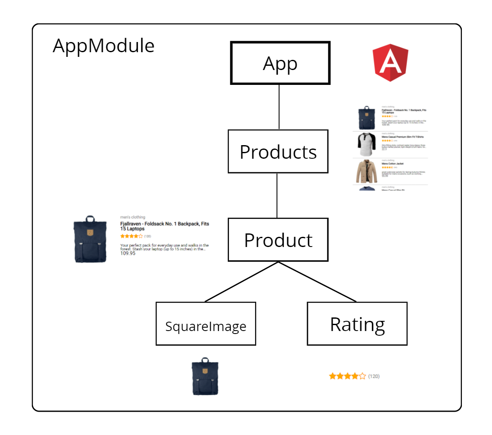
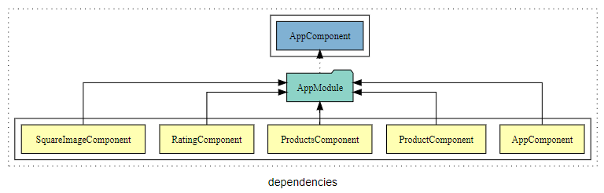
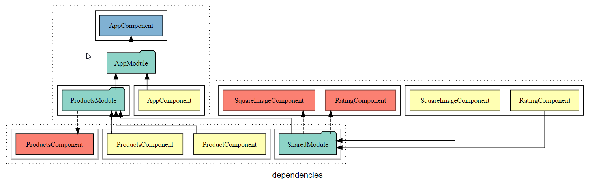
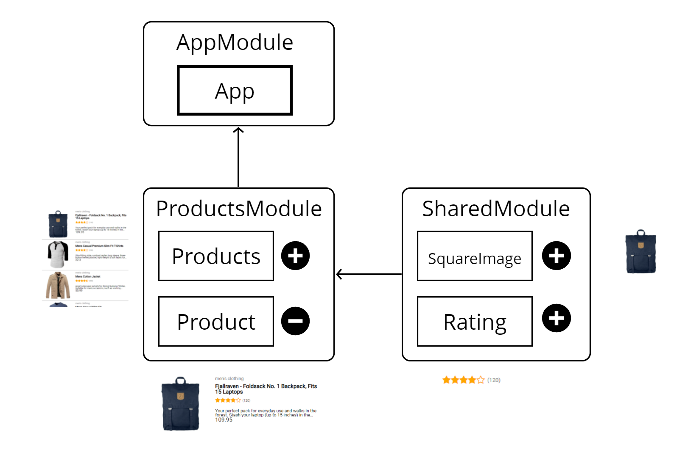

# Assignment 2 Modules
If you want to catch up:

```
git checkout basic/assignment-2
```



## 1.1 Compodoc


To see the current state of our architecture

- Run compodoc:

```
npm run compodoc
```

- Lookup the `AppModule` in compodoc and see that all components are coupled.



Resources:
- [Compodoc](https://compodoc.app/)

## 1.2 Prepare refactor
The `AppModule` is coupled to the features which means there's no way to optimize productions builds and share code.
To fix this problem we will have to refactor the application.

- Go to `AppModule` and remove all components except for `AppComponent`. **Note this will break your application**.

Resources:
- [Cheat sheet NgModules](https://angular.io/guide/cheatsheet)

## 1.3 Feature Module
From a functional point of view we can establish that we have a Products feature in our app.

- Generate a products module:

```
ng g m products
```

`ProductsComponent` should be on the same level as `ProductsModule` which is good (see [style guide](https://angular.io/guide/styleguide#file-tree))

- Make sure `ProductsComponent` is `declared` and `exported` in `ProductsModule`.

- Move the `product` folder to `products/product` and declare `ProductComponent` in `ProductsModule`.

- Add `ProductsModule` to `AppModule`'s `imports`. 

Resources:
- [FeatureModule](https://angular.io/guide/feature-modules)

## 1.4 Shared module

- Generate a shared module:

```
ng g m shared
```

- Refactor `SquaredImageComponent` and `RatingComponent` so it's `declared` and `exported` by `SharedModule`.

- Add `SharedModule` to `ProductsModule` feature module's `imports`.


- Run compodoc and check if the architecture is as follows:



Which is the same as:



Resources:
- [SharedModule](https://angular.io/guide/sharing-ngmodules)

Your app should be working again.

[Solution](https://github.com/Rachnerd/ov-angular/compare/basic/assignment-2...basic/assignment-3)
